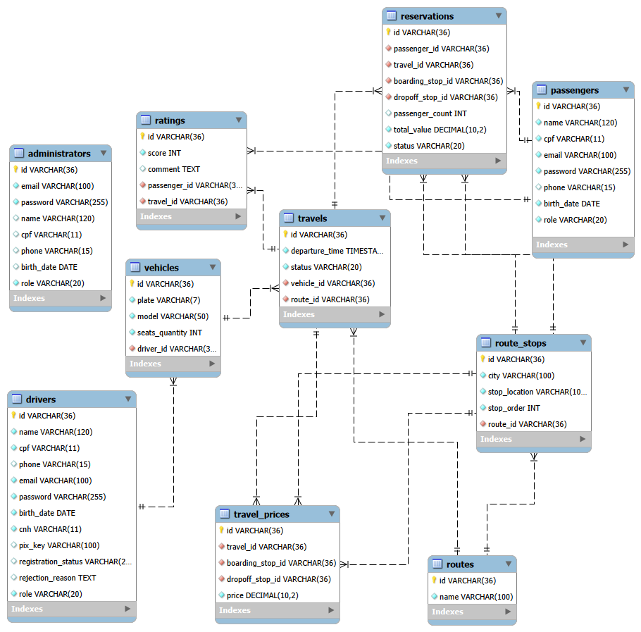

# Banco de Dados - Sistema de Gestão de Transporte de Vans

<div align="center">

 <p>
    Projeto desenvolvido para a disciplina de <b>Banco de Dados</b> do curso de Ciência da Computação da 
    <b>Universidade Federal do Agreste de Pernambuco (UFAPE)</b>.
  </p>
  
</div>
---

## Sobre o projeto

Este projeto consiste no desenvolvimento de um banco de dados para uma aplicação web que implementa um sistema de gerenciamento de viagens intermunicipais por meio de veículos fretados.

O objetivo é a implementação de um banco de dados funcional como requisito para aprovação na disciplina de Banco de Dados, ministrada pela professora **Priscilla Azevedo**, na Universidade Federal do Agreste de Pernambuco - UFAPE, durante o semestre de 2025.2.

## Equipe
<div align="center">
  <a href="https://github.com/baracholeticia">
    
  </a>
  <a href="https://github.com/jmatheusnl">
    
  </a>
  <a href="https://github.com/melissa-08">
    
  </a>
  <a href="https://github.com/josematheusleal">
    
  </a>
</div>

---

## Como Rodar o Projeto

### Pré-requisitos
* **Docker Desktop** instalado e rodando.
* **Git** para clonar o repositório.

### Passo a Passo
1.  **Clone o repositório:**
    ```bash
    git clone [https://github.com/baracholeticia/banco-de-dados_sistema-vans.git](https://github.com/baracholeticia/banco-de-dados_sistema-vans.git)
    cd banco-de-dados_sistema-vans
    ```

2.  **Suba o container do banco de dados:**
    ```bash
    docker compose up -d
    ```

3.  **Acesse o banco:**
    O banco de dados estará disponível em `localhost:3307`. Você pode utilizar o terminal ou ferramentas como MySQL Workbench/DBeaver:
    * **User:** `root`
    * **Password:** `root`
    * **Database:** `SistemaVan`

---

## Modelagem do Banco de Dados

### Diagrama de Entidade-Relacionamento (DER)


### Esquema Lógico



---

<h2 id="dicionario"> Dicionário de Dados (2FN)</h2>

<p>Abaixo estão detalhadas todas as entidades do sistema, seus tipos de dados e restrições de integridade.</p>

<details open>
<summary><b>1. Tabela: MOTORISTA</b></summary>
<br>
<table width="100%">
  <thead>
    <tr style="background-color: #f2f2f2;">
      <th>Atributo</th>
      <th>Tipo</th>
      <th>Restrição</th>
      <th>Descrição</th>
    </tr>
  </thead>
  <tbody>
    <tr><td>id_motorista</td><td>INT</td><td>PK, AI</td><td>Identificador único do motorista.</td></tr>
    <tr><td>nome</td><td>VARCHAR(100)</td><td>NOT NULL</td><td>Nome completo do condutor.</td></tr>
    <tr><td>cpf</td><td>VARCHAR(11)</td><td>UNIQUE, NOT NULL</td><td>CPF (apenas números).</td></tr>
    <tr><td>telefone</td><td>VARCHAR(15)</td><td>NOT NULL</td><td>Telefone de contato.</td></tr>
    <tr><td>chave_pix</td><td>VARCHAR(100)</td><td>NOT NULL</td><td>Chave pix para recebimento de pagamentos.</td></tr>
    <tr><td>email</td><td>VARCHAR(100)</td><td>NOT NULL</td><td>Email do condutor.</td></tr>
  </tbody>
</table>
</details>

<br>

<details>
<summary><b>2. Tabela: VEICULO</b></summary>
<br>
<table width="100%">
  <thead>
    <tr style="background-color: #f2f2f2;">
      <th>Atributo</th>
      <th>Tipo</th>
      <th>Restrição</th>
      <th>Descrição</th>
    </tr>
  </thead>
  <tbody>
    <tr><td>placa</td><td>VARCHAR(7)</td><td>PK</td><td>Placa do veículo.</td></tr>
    <tr><td>modelo</td><td>VARCHAR(50)</td><td>NOT NULL</td><td>Modelo da Van.</td></tr>
    <tr><td>qtd_assentos</td><td>INT</td><td>NOT NULL</td><td>Capacidade máxima de passageiros.</td></tr>
    <tr><td>id_motorista</td><td>INT</td><td>FK</td><td>Motorista responsável pelo veículo.</td></tr>
  </tbody>
</table>
</details>

<br>

<details>
<summary><b>3. Tabela: ROTA</b></summary>
<br>
<table width="100%">
  <thead>
    <tr style="background-color: #f2f2f2;">
      <th>Atributo</th>
      <th>Tipo</th>
      <th>Restrição</th>
      <th>Descrição</th>
    </tr>
  </thead>
  <tbody>
    <tr><td>id_rota</td><td>INT</td><td>PK, AI</td><td>ID único da rota.</td></tr>
    <tr><td>nome_linha</td><td>VARCHAR(100)</td><td>NOT NULL</td><td>Nome comercial (Ex: GaranhunsXCaruaru).</td></tr>
  </tbody>
</table>
</details>

<br>

<details>
<summary><b>4. Tabela: PONTO</b></summary>
<br>
<table width="100%">
  <thead>
    <tr style="background-color: #f2f2f2;">
      <th>Atributo</th>
      <th>Tipo</th>
      <th>Restrição</th>
      <th>Descrição</th>
    </tr>
  </thead>
  <tbody>
    <tr><td>id_ponto</td><td>INT</td><td>PK, AI</td><td>ID da parada física.</td></tr>
    <tr><td>cidade</td><td>VARCHAR(100)</td><td>NOT NULL</td><td>Cidade onde se localiza o ponto.</td></tr>
    <tr><td>local_parada</td><td>VARCHAR(150)</td><td>NOT NULL</td><td>Referência (Ex: Relógio das Flores).</td></tr>
    <tr><td>ordem_na_rota</td><td>INT</td><td>NOT NULL</td><td>Sequência lógica na rota (1, 2, 3...).</td></tr>
    <tr><td>id_rota</td><td>INT</td><td>FK</td><td>Vínculo com a Rota correspondente.</td></tr>
  </tbody>
</table>
</details>

<br>

<details>
<summary><b>5. Tabela: VIAGEM</b></summary>
<br>
<table width="100%">
  <thead>
    <tr style="background-color: #f2f2f2;">
      <th>Atributo</th>
      <th>Tipo</th>
      <th>Restrição</th>
      <th>Descrição</th>
    </tr>
  </thead>
  <tbody>
    <tr><td>id_viagem</td><td>INT</td><td>PK, AI</td><td>Registro de uma execução da rota.</td></tr>
    <tr><td>horario_saida</td><td>TIME</td><td>NOT NULL</td><td>Horário de partida da origem.</td></tr>
    <tr><td>status</td><td>VARCHAR(20)E</td><td>NOT NULL</td><td>Disponibilidade da viagem.</td></tr>
    <tr><td>id_rota</td><td>INT</td><td>FK</td><td>Rota que será executada nesta viagem.</td></tr>
    <tr><td>id_motorista</td><td>INT</td><td>FK</td><td>Motorista que executará a viagem.</td></tr>
    <tr><td>placa</td><td>VARCHAR(7)</td><td>FK</td><td>Veículo alocado para esta viagem.</td></tr>
  </tbody>
</table>
</details>

<br>

<details>
<summary><b>6. Tabela: PRECOS_TRECHOS</b></summary>
<br>
<table width="100%">
  <thead>
    <tr style="background-color: #f2f2f2;">
      <th>Atributo</th>
      <th>Tipo</th>
      <th>Restrição</th>
      <th>Descrição</th>
    </tr>
  </thead>
  <tbody>
    <tr><td>id_viagem</td><td>INT</td><td>PK, FK</td><td>ID da viagem a qual esses preços pertencem.</td></tr>
    <tr><td>id_ponto_subida</td><td>INT</td><td>PK, FK</td><td>ID do ponto inicial do trecho.</td></tr>
    <tr><td>id_ponto_descida</td><td>INT</td><td>PK, FK</td><td>ID do ponto final do trecho.</td></tr>
    <tr><td>valor_trecho</td><td>DECIMAL(10,2)</td><td>NOT NULL</td><td>Preço fixado para este par de pontos.</td></tr>
  </tbody>
</table>
</details>

<br>

<details>
<summary><b>7. Tabela: CLIENTE</b></summary>
<br>
<table width="100%">
  <thead>
    <tr style="background-color: #f2f2f2;">
      <th>Atributo</th>
      <th>Tipo</th>
      <th>Restrição</th>
      <th>Descrição</th>
    </tr>
  </thead>
  <tbody>
    <tr><td>id_cliente</td><td>INT</td><td>PK, AI</td><td>ID único do passageiro.</td></tr>
    <tr><td>nome</td><td>VARCHAR(100)</td><td>NOT NULL</td><td>Nome completo do cliente.</td></tr>
    <tr><td>cpf</td><td>VARCHAR(11)</td><td>UNIQUE, NOT NULL</td><td>CPF para fins de reserva.</td></tr>
    <tr><td>telefone</td><td>VARCHAR(15)</td><td>-</td><td>Contato do passageiro.</td></tr>
    <tr><td>email</td><td>VARCHAR(100)</td><td>NOT NULL</td><td>Email do cliente.</td></tr>
  </tbody>
</table>
</details>

<br>

<details>
<summary><b>8. Tabela: RESERVA</b></summary>
<br>
<table width="100%">
  <thead>
    <tr style="background-color: #f2f2f2;">
      <th>Atributo</th>
      <th>Tipo</th>
      <th>Restrição</th>
      <th>Descrição</th>
    </tr>
  </thead>
  <tbody>
    <tr><td><b>id_cliente</b></td><td>INT</td><td>PK, FK</td><td>Identificador do cliente.</td></tr>
    <tr><td><b>id_viagem</b></td><td>INT</td><td>PK, FK</td><td>Identificador da viagem.</td></tr>
    <tr><td><b>id_ponto_subida</b></td><td>INT</td><td>PK, FK</td><td>Ponto de embarque do passageiro.</td></tr>
    <tr><td><b>id_ponto_descida</b></td><td>INT</td><td>PK, FK</td><td>Ponto de desembarque do passageiro.</td></tr>
    <tr><td>qtd_passageiros</td><td>INT</td><td>NOT NULL</td><td>Quantidade de assentos reservados.</td></tr>
    <tr><td>valor_total_reserva</td><td>DECIMAL(10,2)</td><td>-</td><td>Valor final calculado para a reserva.</td></tr>
    <tr><td>status_reserva</td><td>VARCHAR(20)</td><td>-</td><td>Estado atual (ex: Confirmada, Pendente).</td></tr>
  </tbody>
</table>
</details>

<br>

<details open>
<summary><b>9. Tabela: AVALIACAO</b></summary>
<br>
<table width="100%">
  <thead>
    <tr style="background-color: #f2f2f2;">
      <th>Atributo</th>
      <th>Tipo</th>
      <th>Restrição</th>
      <th>Descrição</th>
    </tr>
  </thead>
  <tbody>
    <tr><td><b>id_avaliacao</b></td><td>INT</td><td>PK, AI</td><td>Identificador único da avaliação.</td></tr>
    <tr><td>pontuacao</td><td>INT</td><td>CHECK (1-5)</td><td>Nota de satisfação dada pelo cliente.</td></tr>
    <tr><td>comentario</td><td>TEXT</td><td>-</td><td>Feedback em texto sobre o serviço.</td></tr>
    <tr><td><b>id_motorista</b></td><td>INT</td><td>FK</td><td>Identificador do motorista avaliado.</td></tr>
    <tr><td><b>id_cliente</b></td><td>INT</td><td>FK</td><td>Identificador do cliente que realizou a avaliação.</td></tr>
  </tbody>
</table>
</details>

---

## Povoamento do Banco
O banco de dados é automaticamente populado na inicialização do container MySQL via Docker, utilizando script SQL do arquivo populate.sql. Os dados inseridos representam cenários reais de operação do sistema, incluindo motoristas, veículos, rotas, pontos de parada, viagens, preços por trecho, clientes, reservas e avaliações, respeitando a integridade referencial entre as tabelas.

---

## Tecnologias Utilizadas
* **MySQL 8.0**: Sistema gerenciador de banco de dados.
* **Docker & Docker Compose**: Containerização do ambiente.
* **Git/GitHub**: Controle de versão e hospedagem do código.
